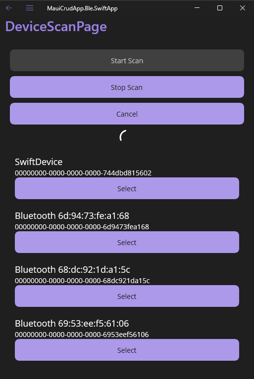

# MauiCrudApp.Ble.SwiftApp & ble-swift-device

This repository contains two interrelated projects: **MauiCrudApp.Ble.SwiftApp**, a cross-platform mobile application built with .NET MAUI and Plugin.BLE, and **ble-swift-device**, a firmware implementation for ESP32 using the ESP-IDF framework. Together, they demonstrate a high-speed, low-latency Bluetooth Low Energy (BLE) communication system designed for bidirectional data transfer.

**GitHub Repository**: [https://github.com/shoderico/MauiCrudApp.Ble.SwiftApp](https://github.com/shoderico/MauiCrudApp.Ble.SwiftApp)

## Screenshots

Below are screenshots showcasing the key features of the `MauiCrudApp.Ble.SwiftApp` mobile application:

| **Device Scan Page** | **Device Connect Page** | **Characteristic Control Page** |
|----------------------|-------------------------|-------------------------------|
|  <br> Scanning for nearby BLE devices. |  <br> Connecting to an ESP32 device. |  <br> Interacting with BLE characteristics, showing bps and Max bps. |

## Features

- **High-Speed, Low-Latency Communication**:
  - Bidirectional communication between the app and device using response-free BLE characteristics:
    - Device-to-App communication.
    - App-to-Device communication.
  - Achieves stable 10-byte data transfers every 30ms in both directions without noticeable latency.

- **MauiCrudApp.Ble.SwiftApp**:
  - Built with .NET MAUI for cross-platform support (Android, iOS, Windows).
  - Utilizes Plugin.BLE for BLE communication.
  - Provides real-time monitoring of data transfer rates (bps) and maximum transfer rates (Max bps).
  - Implements a 30ms interval writing mechanism to the device.
  - Supports BLE characteristic notifications for receiving data from the device.

- **ble-swift-device**:
  - Firmware for ESP32, developed using the ESP-IDF framework.
  - Implements 30ms interval notifications to send data to the app.
  - Handles 30ms interval write operations from the app.

## Project Structure

### MauiCrudApp.Ble.SwiftApp
- **Solution File**: `MauiCrudApp.Ble.SwiftApp.sln`
  - Contains three projects: `MauiCrudApp.Ble.SwiftApp`, `MauiCrudApp.Common`, and `MauiCrudApp.Ble`.

#### Directory Structure
```
MauiCrudApp.Ble.SwiftApp/
├── Converters/
│   ├── BoolToNotifyTextConverter.cs           # Converts boolean to notify button text
│   ├── BoolToStringConverter.cs              # Converts boolean to string for UI
│   ├── ByteArrayToHexConverter.cs            # Converts byte arrays to hex strings
│   └── ByteArrayToStringConverter.cs         # Converts byte arrays to UTF-8 strings
├── Features/
│   ├── Characteristic/
│   │   ├── ViewModels/
│   │   │   ├── CharacteristicControlParameter.cs   # Parameter for characteristic control
│   │   │   ├── CharacteristicControlViewModel.cs   # Base view model for characteristic control
│   │   │   ├── CharacteristicControlViewModelEx.cs # Extended view model with write timer
│   │   │   ├── CharacteristicStateStore.cs         # Manages characteristic state
│   │   │   └── CharacteristicViewModel.cs          # View model for individual characteristics
│   │   └── Views/
│   │       ├── CharacteristicControlPage.xaml      # UI for characteristic interactions
│   │       └── CharacteristicControlPage.xaml.cs   # Code-behind for characteristic page
│   ├── Device/
│   │   ├── ViewModels/
│   │   │   ├── DeviceConnectParameter.cs          # Parameter for device connection
│   │   │   ├── DeviceConnectViewModel.cs          # View model for device connection
│   │   │   ├── DeviceScanParameter.cs             # Parameter for device scanning
│   │   │   └── DeviceScanViewModel.cs             # View model for device scanning
│   │   └── Views/
│   │       ├── DeviceConnectPage.xaml             # UI for device connection
│   │       ├── DeviceConnectPage.xaml.cs          # Code-behind for device connection
│   │       ├── DeviceScanPage.xaml                # UI for device scanning
│   │       └── DeviceScanPage.xaml.cs             # Code-behind for device scanning
├── Platforms/
│   ├── Android/
│   │   ├── AndroidManifest.xml                   # Android app permissions and config
│   ├── iOS/
│   │   ├── Info.plist                            # iOS app permissions and config
├── App.xaml                                     # App resource definitions
├── App.xaml.cs                                  # App initialization logic
├── AppShell.xaml                                # Navigation shell with flyout menu
├── AppShell.xaml.cs                             # Shell code-behind
├── MainPage.xaml                                # Default home page UI
├── MainPage.xaml.cs                             # Home page logic
├── MauiCrudApp.Ble.SwiftApp.csproj              # Project file with build settings
└── MauiProgram.cs                               # App configuration and DI setup
```

### ble-swift-device
- **Main File**: `main/ble-swift-device.c`
  - Implements the BLE server logic for ESP32.

#### Directory Structure
```
ble-swift-device/
├── main/
│   ├── ble-swift-device.c                       # BLE server implementation
│   └── CMakeLists.txt                           # Main component build config
└── CMakeLists.txt                               # Top-level ESP-IDF project config
```

## Getting Started

### Prerequisites

#### For MauiCrudApp.Ble.SwiftApp
- **.NET 8.0 SDK**
- **Visual Studio 2022** (with MAUI workload)
- **Android SDK** (for Android builds)
- **Xcode** (for iOS builds, macOS required)
- **Plugin.BLE NuGet package** (included via `MauiCrudApp.Ble.SwiftApp.csproj`)

#### For ble-swift-device
- **ESP-IDF v5.4.1**
- **CMake 3.16 or higher**
- **ESP32-S3 development board**
- **Python 3.11** (for ESP-IDF tools)
- **Xtensa toolchain** (included in ESP-IDF setup)

### Installation

#### MauiCrudApp.Ble.SwiftApp
1. Clone the repository:
   ```bash
   git clone https://github.com/shoderico/MauiCrudApp.Ble.SwiftApp.git
   cd MauiCrudApp.Ble.SwiftApp
   ```
2. Open `MauiCrudApp.Ble.SwiftApp.sln` in Visual Studio.
3. Restore NuGet packages.
4. Set the target platform (Android, iOS, or Windows) and build the solution.
5. Deploy to a device or emulator.

#### ble-swift-device
1. Clone the repository (if not already done):
   ```bash
   git clone https://github.com/shoderico/MauiCrudApp.Ble.SwiftApp.git
   cd ble-swift-device
   ```
2. Set up ESP-IDF:
   ```bash
   cd <esp-idf-path>
   ./install.sh
   . ./export.sh
   ```
3. Configure the project:
   ```bash
   idf.py set-target esp32s3
   idf.py menuconfig  # Optional: customize SDK configuration
   ```
4. Build and flash:
   ```bash
   idf.py build
   idf.py -p <port> flash
   ```
5. Monitor the device:
   ```bash
   idf.py monitor
   ```

### Usage

1. **Launch the App**:
   - Open `MauiCrudApp.Ble.SwiftApp` on your mobile device or emulator.
   - Navigate to the "Device" menu to scan for BLE devices.
   - Select the ESP32 device running `ble-swift-device` firmware.

2. **Connect and Communicate**:
   - Use the "Device" page to connect to the ESP32.
   - Navigate to the "Characteristic" page to interact with BLE characteristics.
   - Monitor real-time bps and Max bps for read, write, and notify operations.
   - Use the "Start Writing" button to initiate 30ms interval writes (10 bytes per write).
   - Enable notifications to receive 30ms interval data from the device.

3. **ESP32 Device**:
   - The device advertises as a BLE server.
   - It sends 10-byte notifications every 30ms to the connected app.
   - It receives and processes 10-byte write operations from the app every 30ms.

## Performance
- **Bidirectional Communication**:
  - 10 bytes every 30ms in both directions (app ↔ device).
  - Achieves low latency with response-free characteristics.
- **Monitoring**:
  - The app provides real-time feedback on data transfer rates (bps) and peak performance (Max bps).
  - Stable performance validated for continuous operation.

## Contributing
Contributions are welcome! Please follow these steps:
1. Fork the repository.
2. Create a feature branch (`git checkout -b feature/your-feature`).
3. Commit your changes (`git commit -m "Add your feature"`).
4. Push to the branch (`git push origin feature/your-feature`).
5. Open a pull request.

## License
This project is licensed under the MIT License. See the [LICENSE](LICENSE) file for details or visit the [GitHub repository](https://github.com/shoderico/MauiCrudApp.Ble.SwiftApp) for more information.

## Acknowledgments
- Built with [.NET MAUI](https://dotnet.microsoft.com/apps/maui) and [Plugin.BLE](https://github.com/xabre/xamarin-bluetooth-le).
- Powered by [ESP-IDF](https://github.com/espressif/esp-idf) for ESP32.
- Inspired by the need for high-speed, low-latency BLE communication.